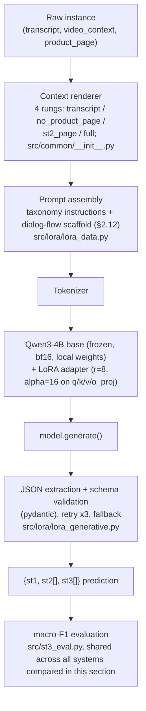
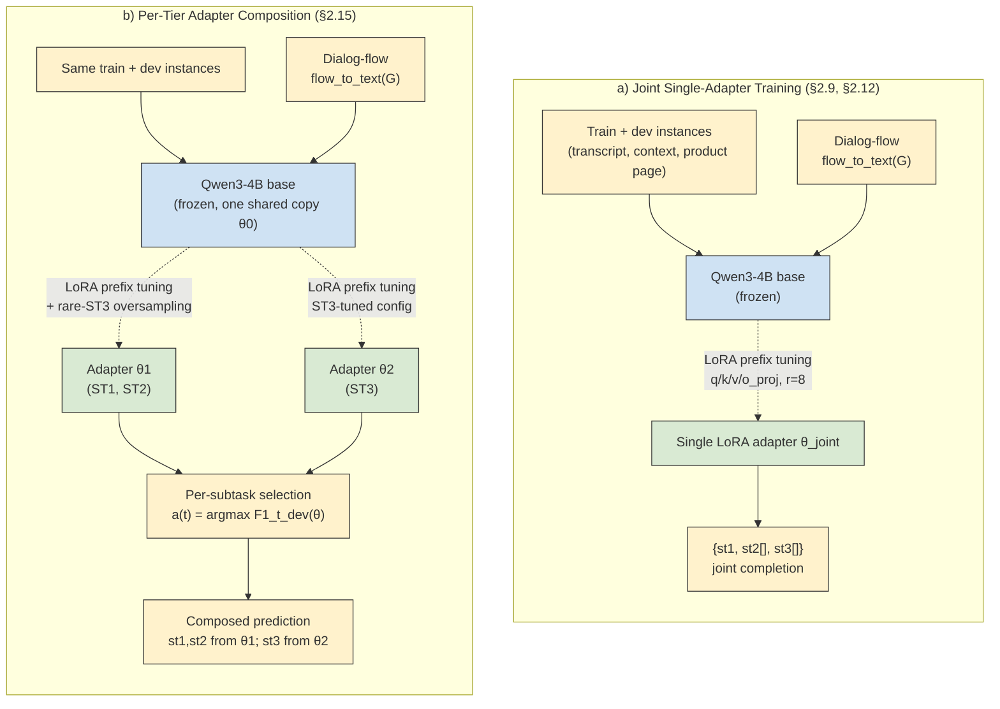
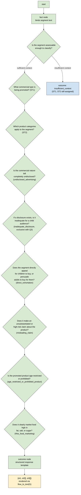
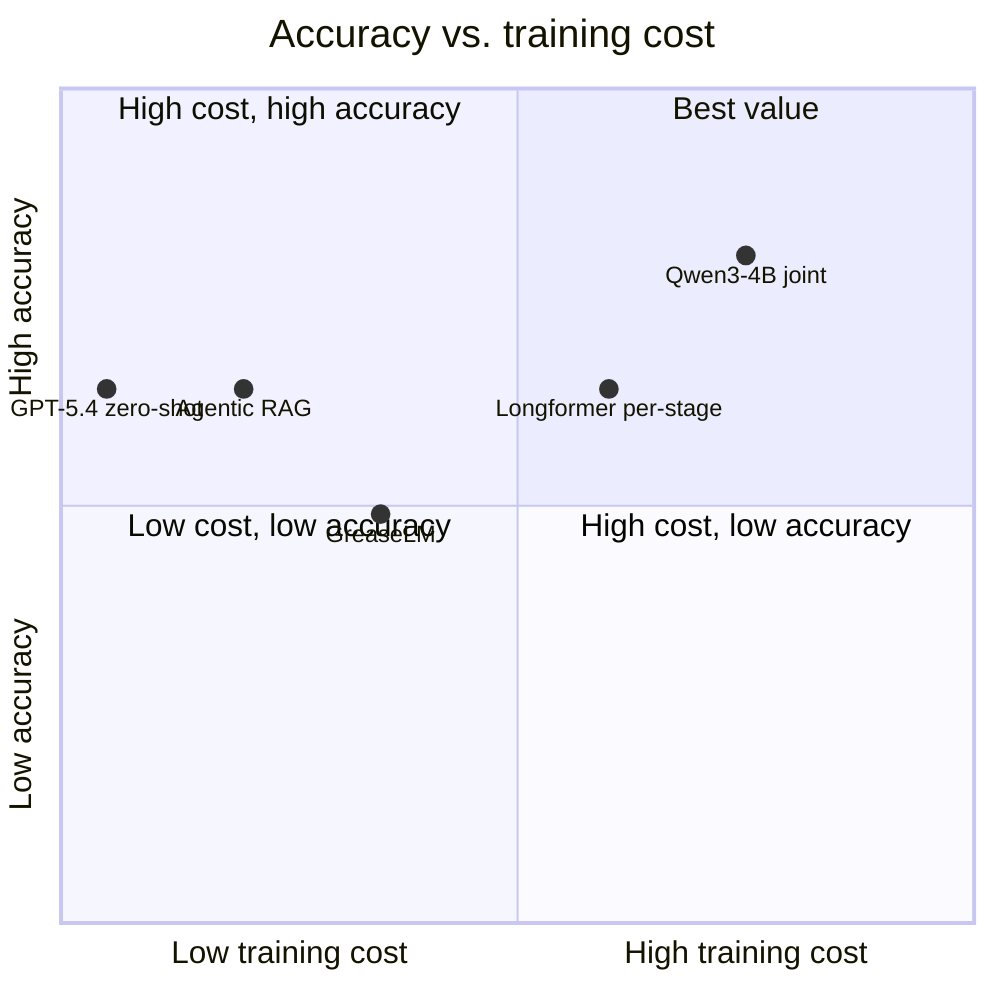

# System Design Report: Qwen3-4B for ChildSafeAds

## Abstract

On the official ChildSafeAds leaderboard, our submission placed 4th ovrerall, 2nd on Subtask 2, and 3rd on Subtask 3 among all participating systems. We achieve this by fine-tuning Qwen3-4B (Qwen Team, 2025) with Low-Rank Adaptation (LoRA; Hu et al., 2021) to generate all three subtask labels, namely commercial type (Subtask 1), product category (Subtask 2), and advertising-compliance flags (Subtask 3), as a single structured completion per instance, conditioned on an expert-authored reasoning scaffold we term a **dialog flow**: a directed-graph encoding of the labeling taxonomy's own decision procedure, where each node pairs a legal test with an explicit answer set and free-text, expert-authored instructions for resolving it, including how it relates to and excludes neighboring tests, authored by a legal domain expert and rendered as compact plain-text pre-context prepended to every prompt (§2.12). This scaffold is the central novel contribution of our system: it lets the model condition on the taxonomy's reasoning structure directly rather than infer it from prose. This joint, generation-based formulation outperforms every alternative architecture we evaluated on the shared macro-F1 metric, including frontier LLMs like GPT-5.4, both zero-shot and as a frontier agent augmented with retrieval-augmented generation against a legal knowledge base (Lewis et al., 2020), five independently trained per-stage Longformer classifiers (Beltagy et al., 2020), and a graph-reasoning baseline built on GreaseLM (Zhang et al., 2022):

| System | dev ST1 | dev ST2 | dev ST3 | dev ST3-family | dev mean |
|---|---|---|---|---|---|
| **Qwen3-4B, joint LoRA (this work)** | **0.850** | 0.714 | **0.555** | **0.653** | **0.706** |
| Best per-stage Longformer classifiers (3 independent adapters) | 0.591 | 0.718 | 0.537 | not logged | 0.615 (avg. of 3 separate models) |
| GPT-5.4, zero-shot | 0.716 | 0.716 | 0.493 | 0.625 | 0.641 |
| GPT-5.4, agentic RAG against a legal knowledge base | 0.723 | **0.726** | 0.463 | 0.616 | 0.637 |
| GreaseLM (300-instance dev subsample) | 0.671 | 0.450 | 0.346 | 0.491 | 0.489 |

The deployed final submission refines this single-adapter result further: it loads a single shared Qwen3-4B base alongside multiple independently trained, subtask-specific LoRA adapters, and routes each subtask's prediction to whichever adapter scored best on it during development (§2.15), rather than relying on one checkpoint alone; see §3.3 for the leaderboard result. The remainder of this report specifies the method, its training and evaluation protocol, the comparison against every alternative system we implemented, and its cost/generalization trade-offs and limitations.

## 1. Task Formulation

The shared task decomposes into three subtasks, Subtask 1 (ST1), Subtask 2 (ST2), and Subtask 3 (ST3), over child-facing commercial video segments, each scored by macro-averaged F1 (Sokolova and Lapalme, 2009) and combined into a single `mean_macro_f1`:

- **ST1** (single-label): commercial type, one of `physical_goods`, `digital_content_or_services`, `physical_services`, `none`, `other`.
- **ST2** (multi-label): product category, 12 labels (e.g. `apps`, `gambling`, `gambling_adjacent`).
- **ST3** (multi-label): advertising-compliance risk flags, 8 Tier-1 labels scored both at the flag level (e.g. `undisclosed_advertising`, `misleading_claim`, `direct_exhortation`, `hfss_food_marketing`) and at the family level (`disclosure`, `content`, `product`, `housekeeping`).

Each subtask's score is macro-averaged F1 over its own label set $\mathcal{L}$,

$$
F1_{\text{macro}} = \frac{1}{|\mathcal{L}|} \sum_{\ell \in \mathcal{L}} \frac{2 P_\ell R_\ell}{P_\ell + R_\ell},
$$

and the three subtask scores combine into the shared task's headline metric, denoted $M$ (`mean_macro_f1`),

$$
M = \frac{1}{3}\Big(F1_{\text{macro}}^{\text{ST1}} + F1_{\text{macro}}^{\text{ST2}} + F1_{\text{macro}}^{\text{ST3}}\Big).
$$

## 2. Methods

Here we outline our approach and every baseline system we implemented for comparison, ordered from the simplest floor baseline up through the full design we submit.

### 2.1 Classical Machine Learning Baselines

Over a fixed feature set (findings-derived structural features plus TF-IDF), we evaluate decision trees, random forests (Breiman, 2001), histogram-based gradient boosting (Friedman, 2001), logistic regression, a from-scratch multilayer perceptron, and XGBoost (Chen and Guestrin, 2016) in a per-label ensemble configuration, restricted to ST3.

### 2.2 RoBERTa Per-Stage Classifiers

We fine-tune LoRA-adapted RoBERTa-base (Liu et al., 2019) encoder classifiers independently per subtask. Unlike the decoder-only architecture we adopt for our own method (§2.9), RoBERTa is encoder-only and normally pre-trained on the masked language modelling task (Devlin et al., 2019). RoBERTa's 512-token position-embedding ceiling truncates the product-page portion of context (§2.11) for the majority of our instances, a limitation that motivates our use of Longformer below (§2.4).

### 2.3 LEGAL-BERT

We additionally fine-tune `legal-bert-base-uncased` (Chalkidis et al., 2020), a fully domain-adapted version of BERT for the legal domain, as a further encoder-classifier baseline, using the same per-subtask LoRA-adapted classification setup as our RoBERTa baseline (§2.2). Its parameter count (109M) is comparable to RoBERTa-base (125M); like RoBERTa, it is limited to a 512-token context window.

### 2.4 Longformer Per-Stage Classifiers

Of the three encoder architectures we evaluate as per-stage classifiers, Longformer-base-4096 (Beltagy et al., 2020) is the strongest, owing specifically to its native 4096-token position-embedding ceiling, which allows genuine access to the product-page context that RoBERTa's and LEGAL-BERT's 512-token ceilings truncate for the majority of instances (§2.11). We report its best results per subtask from independently trained adapters, three to five configurations per subtask (§3.1, Table 2), in contrast to the single joint model we introduce below (§2.9).

### 2.5 Frozen-Encoder RoBERTa Baseline

A RoBERTa-base encoder with only its final layer unfrozen and no adapter-based fine-tuning (`src/last_layer/`), evaluated on the development set only.

### 2.6 Span-Based Disclosure Tagger

A RoBERTa-base token-classification model trained to tag disclosure-relevant spans, targeting only the `undisclosed_advertising` and `inadequate_disclosure` labels via evidence-span supervision (`src/disclosure_tagger_train.py`); the end-to-end pipeline converting tagged spans into full predictions was not completed.

### 2.7 Zero-Shot and Retrieval-Augmented Prompting

We evaluate zero-shot prompting of GPT-5.4 (OpenAI, 2026) against the task's full taxonomy prompt, and an agentic retrieval-augmented generation (agentic RAG; Lewis et al., 2020) variant that iteratively queries a public legal vector knowledge database before producing a final prediction (`src/baseline_agentic_rag.py`). Neither was evaluated against the held-out test split.

### 2.8 Graph-Reasoning Baseline: GreaseLM

We adapt GreaseLM (Zhang et al., 2022), which fuses a pretrained language model with a graph neural network operating over a task-relevant knowledge graph, by constructing that graph from the same dialog-flow representation used by our own method and described in full below (§2.12) (`src/greaselm/kg/build_kg.py`).

### 2.9 Qwen3-4B Joint Generative Model

To establish our own approach, we formulate all three subtasks as a single sequence-generation problem: given an instance's rendered context and a fixed instruction prompt, a decoder-only Transformer (Vaswani et al., 2017) is trained to generate the target label set $\{\text{st1}, \text{st2}[], \text{st3}[]\}$ as one structured JSON completion, rather than training a dedicated classification head per subtask as in §2.2–2.4. Our base model is Qwen3-4B (Qwen Team, 2025), adapted with Low-Rank Adaptation (Hu et al., 2021) via the Hugging Face PEFT library (Mangrulkar et al., 2022). Concretely, LoRA reparameterizes the update to each adapted projection matrix $W_0 \in \mathbb{R}^{d\times k}$ as a low-rank delta,

$$
W' = W_0 + \Delta W = W_0 + \frac{\alpha}{r}BA, \qquad B \in \mathbb{R}^{d\times r},\ A \in \mathbb{R}^{r\times k},\ r \ll \min(d,k),
$$

with $W_0$ kept frozen and only $B$ and $A$ trained. We use rank $r=8$, scaling $\alpha=16$, dropout $0.1$, applied to the query, key, value, and output projection matrices (`q_proj, k_proj, v_proj, o_proj`) of every attention block, yielding 5,898,240 trainable parameters against 4,028,366,336 total (0.146%), with the remainder of the base model frozen (source: run log, §6). This design choice (one joint generative model rather than one classifier per subtask) is both a modeling and an operational decision: it requires a single adapter and a single inference pass to cover all three subtasks, in contrast to the per-stage classification approach used by our own Longformer baseline (§2.4), which required three independently trained adapters (five configurations each) for full task coverage. We quantify this trade-off directly in §4.

The end-to-end system is shown in Figure 1.



**Figure 1: System architecture.**

Model weights are loaded exclusively from local storage (`local_files_only=True`); no runtime download from the Hugging Face Hub occurs. Training and inference are conducted in bfloat16 full precision, following the mixed-precision training regime of Micikevicius et al. (2018); a 4-bit quantized (QLoRA-style) code path is implemented but was not exercised in any reported run, as it was not required to fit training within our compute budget (§2.13).

### 2.10 Base Model Selection

Qwen3-4B was not the first base model considered. Two negative results informed the final choice. `microsoft/Phi-4-mini-instruct` (Microsoft, 2024) trained and generated syntactically valid JSON at a 100-example, single-epoch mini-baseline scale, but collapsed to a single constant output regardless of input (`mean_macro_f1 = 0.000`), indicating insufficient training exposure for this base model on a novel structured-generation task at that scale. `principled-intelligence/gemma-4-E2B-it-text-only`, a third-party derivative of the Gemma architecture (Gemma Team, 2024), showed a real discriminating signal at the same 100-example scale (dev `mean_macro_f1 = 0.562`), but collapsed to near-total generation failure at full scale (dev $\approx 0.004$–$0.007$), producing only an end-of-sequence token for every input despite a healthy training-loss trajectory ($0.55 \rightarrow 0.10$). We attribute this to training instability at the learning rate tuned for Qwen ($2\times10^{-4}$) over substantially more optimization steps than the mini-baseline exposed the model to, rather than to a data or labeling defect. Qwen3-0.6B, the smaller member of the same model family, was used for the majority of hyperparameter and loss-weighting development prior to scaling to Qwen3-4B once that recipe had stabilized.

### 2.11 Context Representation

Following prior context-sensitivity analysis on this dataset, we define four nested context levels: `transcript`, `no_product_page` (transcript + video title/description/disclosure metadata), `st2_page` (+ product-page text filtered to category vocabulary), and `full` (+ the complete product page), implemented in `src/common/__init__.py`. Token-budget coverage across all 2,857 train and development instances is summarized below:

| Context cap (tokens) | Instance coverage |
|---|---|
| 512 | 2.5% |
| 1024 | 32.3% |
| 2048 | 79.0% |
| 4096 | 99.51% |
| 8192 | 99.965% |

A finer-grained, per-label analysis (`st3_findings.md`) found that context sensitivity is highly uneven across the ST3 taxonomy: only `misleading_claim` benefits clearly from the full product-page rung (heuristic F1 $0.451 \rightarrow 0.632$, transcript versus full), while four of the remaining six labels tested show precision degrading faster than recall improves as more context is added. Our standing recipe nonetheless applies the `full` context level uniformly to every instance regardless of which label is being predicted; we treat this as a known inefficiency and quantify its cost in §4.

### 2.12 Dialog-Flow-Augmented Prompting

In addition to a compact natural-language statement of the label taxonomy, every prompt is prepended with a structured, expert-authored reasoning scaffold that we refer to, following the terminology of its authoring platform, as a **dialog flow**. Dialog flows are authored in OpenJustice, a browser-based legal-reasoning authoring and hosted-execution platform developed by the Conflict Analytics Lab; the flow used here (`emnllp-dialog-flow-dialog-flow.json`) encodes the shared task's own labeling procedure as an explicit directed graph, authored by a domain collaborator with reference to `public_data_dev/labels_taxonomy.md`. Figure 2 situates this scaffold within our two adapter-based designs (§2.9 and §2.15); Figure 3 walks through a toy example of the reasoning structure it encodes.



**Figure 2: Training and composition process for our two adapter-based designs.** Blue boxes represent frozen model weights, green boxes represent trainable LoRA parameters, yellow boxes represent data and outputs, and dotted arrows represent the training method (LoRA prefix tuning applied to `q_proj, k_proj, v_proj, o_proj`). Notice that (a) joint single-adapter training and (b) per-tier adapter composition share the same frozen base model and training method, but (b) trains two independently configured adapters and selects between them per subtask (§2.15).

**Structure:** A dialog flow is a small typed state machine. Our flow comprises 14 nodes and 13 edges spanning five node types: a `start` node; a `fact`-gathering node that binds the segment text; `reasoning` nodes, each a bounded question with an explicit answer set and free-text instructions for resolving it; a `switch` node implementing conditional branching; and `outcome` nodes specifying a structured response template. The flow encodes the exact decision sequence a human annotator would follow: an initial assessability check determines whether the segment supports a reliable ST3 judgment at all, routing to a dedicated `insufficient_context` outcome that still requires ST1 and ST2 to be assigned normally, since the taxonomy defines insufficient context as affecting ST3 only; this is followed, for assessable segments, by a commercial-type question (ST1), a product-category question (ST2), and then a strictly ordered sequence of six binary reasoning questions, one per Tier-1 ST3 flag other than the two housekeeping labels (`no_flag`, `insufficient_context`): `undisclosed_advertising`, `inadequate_disclosure`, `direct_exhortation`, `misleading_claim`, `age_restricted_or_prohibited_product`, and `hfss_food_marketing`, in the taxonomy's own dependency order. Each node's instructions state the taxonomy's mutual-exclusivity constraints explicitly: for instance, the `inadequate_disclosure` node is instructed not to fire if `undisclosed_advertising` has already fired, mirroring the taxonomy rule that the two are mutually exclusive. The flow terminates in an outcome node specifying the exact structured-response format the model should produce.


**Figure 3: Toy example of the dialog-flow reasoning structure encoded by our scaffold.** Green nodes represent the strictly ordered sequence every instance's prompt encodes (an assessability check, ST1, ST2, then six binary Tier-1 ST3 reasoning questions in taxonomy dependency order), while the blue outcome node shows the alternate branch taken only when a segment is judged unassessable for ST3. For readability, each question node here is drawn as a bare yes/no branch; in the actual flow, every one of these nodes also carries free-text, expert-authored instructions for resolving it (its decision rule and its exclusivity relationship to neighboring tests, per the `inadequate_disclosure` example below), so the model is guided by considerably more than the branch label alone. The flow itself is static prompt pre-context, not an execution trace: no traversal happens at inference time, since the model conditions on the full rendered graph and generates all labels directly.

**Motivation:** We include this scaffold as prompt pre-context because it operationalizes the labeling taxonomy as an explicit reasoning chain rather than leaving the order and dependencies of its constituent legal tests implicit in prose, in a manner conceptually related to chain-of-thought prompting (Wei et al., 2022): rather than requiring the model to discover, for each novel segment, the correct sequence in which to apply the taxonomy's tests, the flow supplies that sequence directly, together with each test's decision rule and its exclusivity relationship to neighboring tests. Because the taxonomy is shared across every subtask and every baseline in this project, the flow is authored once and consumed by two independent renderers that we verified agree on structure: `src/common/dialog_flow.py`, the text renderer used for our prompts, and `src/greaselm/kg/build_kg.py`, the graph renderer used to construct the GreaseLM baseline's knowledge graph (§2.8); both interpret a switch node's branches identically (as `branch:<compare-value>` and `branch:default` relations), so the encoded reasoning structure is invariant to which system consumes it.

**Formalization:** We express the dialog flow as a directed graph $G = (V, E)$ with node set $V = V_{\text{start}} \cup V_{\text{fact}} \cup V_{\text{reasoning}} \cup V_{\text{switch}} \cup V_{\text{outcome}}$, and edges $E$ encoding the fixed traversal order described above. Each reasoning node $v \in V_{\text{reasoning}}$ carries a bounded answer set $\mathcal{A}_v$ and a free-text decision rule $\rho_v$. Rather than executing $G$ at inference time, we render it once with a fixed serialization function, denoted $\phi: G \to \Sigma^*$ (`flow_to_text`, `src/common/dialog_flow.py`), and prepend the result as static pre-context to every prompt. The trained model is thus a conditional generator

$$
p_\theta\big(y \mid x, \phi(G)\big), \qquad y = \{\text{st1}, \text{st2}[], \text{st3}[]\},
$$

where $x$ is the rendered instance context (§2.11) and $\theta$ are the LoRA parameters of §2.9. This differs from graph-*executing* approaches such as our GreaseLM baseline (§2.8), which consumes the same $G$ as structural input to a graph neural network rather than as serialized text.

**Implementation:** The raw OpenJustice export is a UI-authoring artifact, not a prompt: on our flow, 81% of its content by token count (3,228 of 4,003 tokens, measured with the Qwen3.5 tokenizer) is editor chrome: node canvas positions, pixel dimensions, selection state, CSS class names, and the exporting user's OAuth subject identifier, none of which carries task meaning, and the last of which must not appear in a prompt or training corpus for privacy reasons. We strip this chrome and remap every node's opaque UUID reference to a human-readable label slug (`strip_flow`, `src/common/dialog_flow.py`), then render the result as compact plain text (`flow_to_text`): for our flow this yields 5,685 characters (943 tokens on the same tokenizer, 24% of the raw export's token count) that preserve every question, answer set, branch condition, and outcome template while eliminating editor chrome entirely. This matters operationally because the flow is prepended as fixed pre-context to every training and inference instance under a shared `--max-length` budget, so every chrome token displaces a token of the labeled segment itself once truncation applies. The unstripped, minified-JSON form of the export is retained in the codebase only as an ablation counterpart to this design (obtained by disabling `--lean-prompt`), at approximately four times the token cost for identical semantic content.

### 2.13 Training Procedure

Class imbalance across both ST2 and ST3 is addressed via per-label, inverse-frequency loss weighting applied to completion tokens (`--pos-weight`); the rarest labels (`hfss_food_marketing`, `insufficient_context`) receive a weight of $50\times$. Formally, training minimizes a per-token, per-label-weighted negative log-likelihood over completion tokens,

$$
\theta^\star = \arg\min_\theta \quad -\sum_{i=1}^{N}\sum_{j=1}^{|y_i|} w(y_{i,j}) \log p_\theta\big(y_{i,j} \mid y_{i,<j}, x_i, \phi(G)\big),
$$

where the per-label weight

$$
w(\ell) = \min\left(\frac{n_{\max}}{n_\ell}, 50\right), \qquad \ell \in \mathcal{L}_{\text{ST2}} \cup \mathcal{L}_{\text{ST3}},
$$

is the inverse-frequency weight applied to completion tokens belonging to label $\ell$, capped so that the rarest labels reach the reported $50\times$ ceiling. Model selection across epochs uses `mean_macro_f1` computed via free-form generation (`model.generate()`) against a held-out split, rather than teacher-forced loss, so that the selection criterion matches the deployed inference procedure. Our best-performing configuration is:

```
--model Qwen/Qwen3-4B --context full --lean-prompt --df-path emnllp-dialog-flow-dialog-flow.json
--epochs 20 --batch-size 1 --grad-accum-steps 4 --lr 2e-4 --warmup-ratio 0.06
--lora-r 8 --lora-alpha 16 --lora-dropout 0.1 --target-modules q_proj,k_proj,v_proj,o_proj
--pos-weight --test-holdout 500 --eval-batch-size 16
```

A follow-up sweep of six configurations targeting the residual ST3 weakness observed in this run (finer evaluation cadence, minority-class oversampling, larger effective batch size via gradient accumulation, a lower learning rate with increased dropout, an increased ST3 loss weight, and combinations thereof) was specified (`slurm_dispatch_qwen_generative.sh`) but had not been executed at the time of writing; we report it as a planned extension (§5) rather than report unrun results.

Two engineering interventions were necessary to fit training within a single 23GB GPU (NVIDIA A10G): gradient checkpointing (Chen et al., 2016) was enabled specifically to offset the memory cost of Qwen3-4B's large vocabulary projection head, and model weights are streamed directly to the target device rather than staged in host memory first. A third fix addresses a correctness issue rather than a memory ceiling: the training model instance is explicitly freed (`del model; torch.cuda.empty_cache()`) before a second instance is loaded to score the held-out test split, which is required to avoid an out-of-memory failure at 4B-parameter scale (harmless at the smaller 0.6B scale used during development). Measured (not estimated) training cost for the reported 20-epoch run was 3 hours 46 minutes wall-clock on one A10G, stabilizing at 10–11 minutes per epoch after the first (13 minutes, inclusive of one-time setup), plus a 2 minute 46 second development-set generation pass and a 3 minute 6 second held-out-test generation pass.

### 2.14 Evaluation Protocol

Every training run draws a fresh, randomly re-split 500-instance `test_holdout` from the training file, disjoint from the fixed 504-instance development set, rather than relying solely on a single static development set for model selection, a design intended to detect overfitting to the development split specifically. This protocol surfaced a methodologically relevant finding: across runs with an identical configuration but different random splits, `mean_macro_f1` varies by approximately 0.07–0.22 (`runs/lora-qwen/results.csv`, commit `1294f42`). We therefore report all individual results in this document as single, noisy samples rather than precise point estimates, and flag this explicitly wherever a result has not been replicated (§5).

### 2.15 Per-Tier Adapter Composition

Our deployed system loads a single frozen Qwen3-4B base and switches between two independently trained LoRA adapters, one for ST1/ST2 and one for ST3, sharing the architecture and prompt design of §2.9–2.12. Both final adapters were trained on a single H100 GPU (hyperparameter iteration in §2.13 used a separate A10G), following the same shared-base, per-query adapter-swap principle as LoRA-serving systems like S-LoRA (Sheng et al., 2023), but at much smaller scale.

This design follows from an observation made over the course of development: no single training run we evaluated maximized development-set performance on all three subtasks simultaneously, and ST3 in particular showed a persistent sensitivity to how rare-label handling was configured (§3.2). Rather than committing to one checkpoint as a compromise across all three subtasks, we assign each subtask to whichever trained adapter scored best on it during development. Formally, let $\theta_1$ and $\theta_2$ denote the two independently trained adapter sets sharing the frozen base $\theta_0$ (§2.9), and let $F1^{\text{dev}}_t(\theta)$ denote the development-set macro-F1 of adapter $\theta$ on subtask $t \in \{\text{ST1}, \text{ST2}, \text{ST3}\}$. We assign each subtask to whichever adapter scored best on it during development,

$$
a(t) = \arg\max_{\theta \in \{\theta_1,\theta_2\}} F1^{\text{dev}}_t(\theta),
$$

and read the deployed prediction for subtask $t$ from that adapter alone,

$$
\hat y_t = f\big(x, \phi(G); \theta_0, a(t)\big),
$$

with the base model $\theta_0$ loaded once and shared across both selections. The ST3 adapter reached the highest development-set ST3 score observed for any Qwen3-4B configuration in this project (`st3_macro_f1 = 0.588`, alongside `st1_macro_f1 = 0.842` and `st2_macro_f1 = 0.709` at the same checkpoint), exceeding the single-adapter configuration reported as our headline result in §1 (`st3_macro_f1 = 0.555`). The ST1/ST2 adapter was trained with additional oversampling of instances carrying rare ST3 labels, one of several class-imbalance interventions explored to address the ST3 rare-label failure mode (§2.13, §3.2). Taken together, this per-tier composition outperforms every other Qwen3-4B and Qwen3-0.6B configuration tested over the course of this project on `mean_macro_f1`, across both the base-model-selection sweep (§2.10) and every subsequent hyperparameter and loss-weighting iteration (`runs/lora-qwen/results.csv`).

We note a limitation of this design: the per-tier assignment $a(t)$ reflects which adapter scored best on each subtask individually during development, but we do not have a controlled, side-by-side development-set comparison of both adapters across all three subtasks recorded together, so the gain attributable to per-tier composition over the best single joint checkpoint has not been independently verified (§5).

## 3. Experimental Evaluation

### 3.1 Headline comparison

Table 1 restricts to systems reporting the full three-subtask `mean_macro_f1`, the metric directly comparable to our headline result.

**Table 1: Comparison against baselines reporting a full 3-subtask `mean_macro_f1`.**

| System | Best score | Evaluation split | Source |
|---|---|---|---|
| **Qwen3-4B, joint LoRA (this work)** | **0.706 dev / 0.746 test** | dev $n=504$ / `test_holdout` $n=500$ | `slurm_logs/8-17-runs/results_summary.md` |
| GPT-5.4, zero-shot (§2.7) | 0.641 | dev $n=504$ (not evaluated on test) | `runs/run_20260801_205209_full_gpt-5.4.log` |
| Agentic RAG, GPT-5.4 (§2.7) | 0.637 | dev $n=504$ (not evaluated on test) | `runs/run_20260802_004514_agentic_rag_full_gpt-5.4.log` |
| Frozen-encoder RoBERTa (§2.5) | 0.618 | dev only | `runs/run_20260808_202345_last_layer_train_...log` |
| GreaseLM (§2.8) | 0.489 | dev, $n=300$ subsample (not directly comparable) | `runs/run_20260809_202020_greaselm_train_combined.log` |

Table 2 compares Qwen3-4B's joint prediction directly against the best per-subtask Longformer classifier (§2.4), despite the latter comprising three to five independently trained models.

**Table 2: Per-subtask comparison against the best Longformer classifiers.**

| Subtask | Best Longformer classifier (test) | Qwen3-4B, joint (test) |
|---|---|---|
| ST1 | 0.629 | **0.790** |
| ST2 | 0.808 | **0.842** |
| ST3 | 0.486 | **0.605** |

Our joint model outperforms the best independently trained classifier on all three subtasks. Among the classical ML baselines (§2.1), the best full-8-label ST3 score is $0.525$ (random-forest ensemble, test split; `runs/baseline_decision_tree/results.csv`), below Qwen3-4B's $0.605$; the disclosure tagger (§2.6) reports token-span F1 ($0.256$ dev), a distinct metric not directly comparable to macro-F1.

### 3.2 Error analysis

The label `hfss_food_marketing` scores $F_1 = 0.000$ at our selected checkpoint despite a $50\times$ loss weight, having reached $F_1 = 0.143$ at epoch 10 before regressing to zero by epoch 20: additional training past near-zero training loss actively erased this rare label rather than leaving its performance flat. Manual review of this label's annotations (`st3_findings.md`) found near-identical templated advertising copy from the same channel labeled inconsistently across videos, and positive instances that explicitly state "sugar-free," which is difficult to reconcile with a high-fat/salt/sugar rationale, evidence that the achievable ceiling for this label may be constrained by annotation noise rather than by model capacity alone.

### 3.3 Shared-task test submission


We generated predictions over the official, unlabeled test split ($n=503$) twice: first from the single joint adapter underlying the headline results in §1, and subsequently from the per-tier adapter composition of §2.15, our final submission, in which both tier-specific adapters are loaded into memory alongside the shared frozen Qwen3-4B base and swapped in per subtask as each example is routed to its tier. Neither is independently scorable, as the official test split ships without gold labels. As a sanity check, both submissions' label distributions fall within the ranges established across every development and held-out-test run reported in this document, including the persistent near-absence of `hfss_food_marketing` and `insufficient_context` documented in §3.2.

Once organizer-side scoring against the held-out gold labels was released on the shared task's competition website, our submission ranked 2nd on ST2 (product category) and 3rd on ST3 (advertising-compliance flags) among all participating systems.

### 3.4 Legal Grounding for ST3

Each Tier-1 ST3 flag is itself defined against a fixed set of EU legal instruments, provided with the shared task's release rather than something a system is asked to discover (Table 3).

**Table 3: Legal instruments underlying each scored ST3 flag.**

| Flag | Severity | Primary instruments |
|---|---|---|
| `undisclosed_advertising` | Per se prohibited | UCPD Annex I pt. 11, Arts. 5–9; AVMSD Arts. 9–11, 28b; DSA Arts. 26, 28 |
| `inadequate_disclosure` | Conditional | UCPD Arts. 6–7 read with Art. 5(3); DSA Art. 28 guidelines |
| `direct_exhortation` | Per se prohibited | UCPD Annex I pt. 28; national case law |
| `misleading_claim` | Conditional | UCPD Arts. 6–7; AVMSD Art. 9(1); sectoral food and health-claims rules |
| `age_restricted_or_prohibited_product` | Conditional | AVMSD Art. 9; DSA Art. 28 guidelines; national age-restriction laws |
| `hfss_food_marketing` | Soft law | AVMSD Art. 9(4); UCPD Arts. 5–9 |

Our predictions rely on these provisions only indirectly, through the taxonomy's own behavioral definition of each flag (§2.12): the dialog-flow scaffold and taxonomy prompt encode what each flag means in practice (e.g. the specific disclosure and exhortation tests in §2.12), not the statutory text itself. We did not retrieve or supply the underlying legal text as additional model input, and consequently cannot report whether doing so would improve flag prediction; we record this as an untested direction rather than a negative result (§5).

## 4. Cost, Reliability, Scalability, and Generalization

### 4.1 Cost and measured generalization

Table 4 operationalizes the cost-and-generalizability question directly. Dev/test agreement is reported only where both splits were actually evaluated; the zero-shot, retrieval, and graph-based baselines were never scored against a held-out test split, so their generalization is *unmeasured* rather than established to be worse.

**Table 4: Cost, coverage, and generalization by system.**

| System | Training cost | Models required for full coverage | Inference | Accuracy | Dev/test agreement |
|---|---|---|---|---|---|
| Qwen3-4B, joint (this work) | 3h46m, 1 GPU, single run | 1 | Local generation, one pass/instance | 0.706 dev / 0.746 test | Measured: test $>$ dev, no overfitting signal |
| Longformer, per-stage | ~15–20 min/epoch × 5 configurations × 3 subtasks | 3–5 | Local, classification head | ST1 = 0.629 / ST2 = 0.808 / ST3 = 0.486 (test) | Measured per subtask |
| GPT-5.4, zero-shot | None | 1 prompt | Per-instance API call, cost scales with volume | 0.641 dev | Unmeasured |
| Agentic RAG | None | 1 pipeline + retrieval index | API + retrieval per instance | 0.637 dev | Unmeasured |
| GreaseLM | Graph construction + training | 1 model + graph-construction pipeline | Local, graph-dependent | 0.489 dev (300-instance subsample) | Unmeasured, non-standard data split |



**Figure 4: Accuracy versus training cost (qualitative axes; costs are not in comparable units across systems; see Table 4 for measured figures).**

### 4.2 Reliability

Generation is not guaranteed to produce a schema-valid label set on the first attempt; our inference procedure retries up to three times, resampling on each retry, before falling back to a fixed default prediction (§2.9). Across the 503-instance official test split, the deployed adapters produced zero predictions matching the fallback output, which we take as an upper bound on the practical parse-failure rate for this system rather than a claim that generation never fails internally; a first attempt can fail and still be corrected by a resample before three retries are exhausted. We regard the retry-then-deterministic-fallback design itself, rather than this single observation, as the relevant reliability property: it guarantees every instance receives a schema-valid submission record, with a known, inspectable default (`no_flag`-adjacent placeholder labels) in the rare case that generation cannot be coerced into the target schema at all.

### 4.3 Scalability at Platform Scale

Because inference is a single forward pass through a frozen base model plus a small LoRA delta, throughput scales with ordinary generation batching rather than requiring per-subtask model switching or an external retrieval round-trip. On a single A10G GPU with a batch size of 16, the deployed adapter processed the 503-instance test split's generation phase in under three minutes, on the order of a few hundred milliseconds per instance, amortized. This compares favorably, at inference time, to the API-dependent baselines (§2.7), whose per-instance cost and latency are governed by an external service rather than local compute, and to the retrieval-augmented baseline, which additionally pays a retrieval round-trip per instance. Because the base model is loaded once and adapters are lightweight, horizontal scaling for a continuous monitoring stream is a matter of running additional identical inference workers, without the per-subtask coordination overhead that a multi-classifier deployment (§2.2–2.4) would require.

### 4.4 Context-Level Cost and Accuracy

Cross-referencing the context-level coverage figures (§2.11) against the per-label rung analysis of `st3_findings.md` (Table 5) shows that our uniform use of the `full` context level is costly relative to its measured benefit.

**Table 5: Context level required per ST3 label.**

| Context level | Relative token cost | Labels for which this is the best rung | Labels that regress at this rung |
|---|---|---|---|
| `transcript` | Lowest | `direct_exhortation`, `age_restricted_or_prohibited_product`, `hfss_food_marketing` | none |
| `no_product_page` | + description/disclosure metadata | `undisclosed_advertising`, `insufficient_context`, `inadequate_disclosure`, `no_flag` | `direct_exhortation` (flat), `age_restricted_or_prohibited_product` (precision collapses) |
| `full` | Highest | `misleading_claim` only | `direct_exhortation`, `age_restricted_or_prohibited_product`, `hfss_food_marketing` all regress |

Seven of eight ST3 labels do not benefit from, and several are measurably harmed by, the context level applied uniformly in our standing recipe; a label-conditional context policy is identified as a concrete efficiency improvement in §5. Beyond per-instance cost, the single-adapter design offers an operational advantage independent of accuracy: one deployable artifact and one inference pipeline, versus three to five classifier checkpoints (§2.2–2.4) or a continuously available external API dependency (§2.7), for a system intended to run continuously over a monitoring stream.

### 4.5 Generalization Beyond This Dataset

The architectural choices in §2 are largely dataset-agnostic: a frozen base model adapted by a low-rank delta, a taxonomy expressed as an explicit reasoning scaffold (§2.12), and per-tier adapter composition (§2.15) do not depend on properties specific to this shared task, and should transfer to other structured content-moderation taxonomies provided a comparable decision procedure can be authored for them. Two aspects of our results are less likely to transfer directly. First, the specific class-imbalance interventions and hyperparameters (§2.13) were tuned against this dataset's particular label frequencies, and would need retuning against a different label distribution rather than being assumed to carry over. Second, our held-out evaluation protocol (§2.14) surfaced substantial run-to-run variance (0.07–0.22 `mean_macro_f1`) attributable to this dataset's limited size; a larger deployment dataset would likely reduce this variance, but we have not measured that directly, and any single result reported here should be treated as an estimate under this dataset's specific size and label-frequency constraints rather than a platform-scale guarantee.

## 5. Limitations

- **Rare ST3 labels remain difficult to learn.** `insufficient_context`, `hfss_food_marketing`, and `age_restricted_or_prohibited_product` (15–75 training instances each) are resistant to loss reweighting; §3.2 presents evidence that `hfss_food_marketing` specifically may face an annotation-noise ceiling rather than a purely representational limitation.
- **No external legal-provisions retrieval is integrated into this system** (§3.4): the model relies on the taxonomy's own behavioral definitions rather than on retrieved statutory text, and we did not test whether supplying richer legal context improves flag prediction.
- **Tier-2 destination-transaction flags are out of scope for this system**, consistent with the shared task's framing of Tier 2 as an opt-in track requiring off-platform data collection.

## References

Josef Beltagy, Matthew E. Peters, and Arman Cohan. 2020. Longformer: The Long-Document Transformer. *arXiv:2004.05150*.

Leo Breiman. 2001. Random Forests. *Machine Learning*, 45(1):5–32.

Ilias Chalkidis, Manos Fergadiotis, Prodromos Malakasiotis, Nikolaos Aletras, and Ion Androutsopoulos. 2020. LEGAL-BERT: The Muppets straight out of Law School. In *Findings of the Association for Computational Linguistics: EMNLP 2020*.

Tianqi Chen and Carlos Guestrin. 2016. XGBoost: A Scalable Tree Boosting System. In *Proceedings of the 22nd ACM SIGKDD International Conference on Knowledge Discovery and Data Mining*.

Tianqi Chen, Bing Xu, Chiyuan Zhang, and Carlos Guestrin. 2016. Training Deep Nets with Sublinear Memory Cost. *arXiv:1604.06174*.

Jacob Devlin, Ming-Wei Chang, Kenton Lee, and Kristina Toutanova. 2019. BERT: Pre-training of Deep Bidirectional Transformers for Language Understanding. In *Proceedings of NAACL-HLT 2019*.

Jerome H. Friedman. 2001. Greedy Function Approximation: A Gradient Boosting Machine. *Annals of Statistics*, 29(5):1189–1232.

Gemma Team, Google DeepMind. 2024. Gemma: Open Models Based on Gemini Research and Technology. *arXiv:2403.08295*.

Edward J. Hu, Yelong Shen, Phillip Wallis, Zeyuan Allen-Zhu, Yuanzhi Li, Shean Wang, Lu Wang, and Weizhu Chen. 2021. LoRA: Low-Rank Adaptation of Large Language Models. *arXiv:2106.09685* (ICLR 2022).

Patrick Lewis, Ethan Perez, Aleksandra Piktus, Fabio Petroni, Vladimir Karpukhin, Naman Goyal, Heinrich Küttler, Mike Lewis, Wen-tau Yih, Tim Rocktäschel, Sebastian Riedel, and Douwe Kiela. 2020. Retrieval-Augmented Generation for Knowledge-Intensive NLP Tasks. In *Advances in Neural Information Processing Systems 33 (NeurIPS 2020)*.

Yinhan Liu, Myle Ott, Naman Goyal, Jingfei Du, Mandar Joshi, Danqi Chen, Omer Levy, Mike Lewis, Luke Zettlemoyer, and Veselin Stoyanov. 2019. RoBERTa: A Robustly Optimized BERT Pretraining Approach. *arXiv:1907.11692*.

Sourab Mangrulkar, Sylvain Gugger, Lysandre Debut, Younes Belkada, Sayak Paul, and Benjamin Bossan. 2022. PEFT: State-of-the-Art Parameter-Efficient Fine-Tuning Methods. Hugging Face. https://github.com/huggingface/peft

Microsoft. 2024. Phi-4 Technical Report.

Paulius Micikevicius, Sharan Narang, Jonah Alben, Gregory Diamos, Erich Elsen, David Garcia, Boris Ginsburg, Michael Houston, Oleksii Kuchaiev, Ganesh Venkatesh, and Hao Wu. 2018. Mixed Precision Training. In *International Conference on Learning Representations (ICLR 2018)*.

OpenAI. 2026. GPT-5.4 [Large language model]. Accessed via the OpenAI API.

OpenJustice. Conflict Analytics Lab. Dialog-flow authoring and hosted-execution platform; used for prompt-scaffold authoring (§2.12) and the agentic-RAG baseline (§2.7). No public citation available.

oj-eval / AI4Law. Long Horizon Legal Reasoning with Dispute Resolution. AI4Law Workshop. Submodule providing the retrieval-augmented and dialog-flow-execution baselines (§2.7); full bibliographic details not available in the vendored submodule.

Qwen Team. 2025. Qwen3 Technical Report. *arXiv:2505.09388*.

Ying Sheng, Shiyi Cao, Dacheng Li, Coleman Hooper, Nicholas Lee, Shuo Yang, Christopher Chou, Banghua Zhu, Lianmin Zheng, Kurt Keutzer, Joseph E. Gonzalez, and Ion Stoica. 2023. S-LoRA: Serving Thousands of Concurrent LoRA Adapters. *arXiv:2311.03285*.

Marina Sokolova and Guy Lapalme. 2009. A Systematic Analysis of Performance Measures for Classification Tasks. *Information Processing & Management*, 45(4):427–437.

Ashish Vaswani, Noam Shazeer, Niki Parmar, Jakob Uszkoreit, Llion Jones, Aidan N. Gomez, Łukasz Kaiser, and Illia Polosukhin. 2017. Attention Is All You Need. In *Advances in Neural Information Processing Systems 30 (NIPS 2017)*.

Jason Wei, Xuezhi Wang, Dale Schuurmans, Maarten Bosma, Brian Ichter, Fei Xia, Ed Chi, Quoc Le, and Denny Zhou. 2022. Chain-of-Thought Prompting Elicits Reasoning in Large Language Models. In *Advances in Neural Information Processing Systems 35 (NeurIPS 2022)*.

Xikun Zhang, Antoine Bosselut, Michihiro Yasunaga, Hongyu Ren, Percy Liang, Christopher D. Manning, and Jure Leskovec. 2022. GreaseLM: Graph REASoning Enhanced Language Models for Question Answering. In *International Conference on Learning Representations (ICLR 2022)*.

## Setup

1. **Clone with submodules** (this repo vendors `oj-eval` and `GreaseLM` as git submodules):
   ```
   git clone --recurse-submodules <repo-url>
   # or, if already cloned:
   git submodule update --init --recursive
   ```

2. **Install Python dependencies** (uv-managed venv, Python 3.12):
   ```
   sh setup_uv.sh   # installs uv
   uv venv
   source .venv/bin/activate
   uv pip install -r requirements.txt
   ```

3. **Unpack the shared-task data:**
   ```
   unzip public_data_dev.zip -d public_data_dev
   unzip public_data_test.zip -d public_data_test   # official test split, if you have it
   ```

4. **Place base model weights locally** under `models/<org>/<model>` (e.g. `models/Qwen/Qwen3-4B`). All training and inference here load with `local_files_only=True`; no runtime Hugging Face Hub download occurs, so weights must be downloaded ahead of time, e.g.:
   ```
   huggingface-cli download Qwen/Qwen3-4B --local-dir models/Qwen/Qwen3-4B
   ```

5. **Configure API keys**: only needed for the GPT-5.4 / agentic-RAG baselines or W&B logging, not for the core Qwen3-4B LoRA pipeline. Create a `.env` file in the repo root with whichever of these you need: `OPENAI_API_KEY`, `ANTHROPIC_API_KEY`, `AWS_BEARER_TOKEN_BEDROCK` (+ `AWS_REGION`), `OJ_API_KEY` / `PRIVATE_OJ_API_KEY` (OpenJustice), `WANDB_API_KEY`.

6. **Train and predict**: see the Reproducibility section above for the exact commands to reproduce the reported training run and to compose the final per-tier submission.
