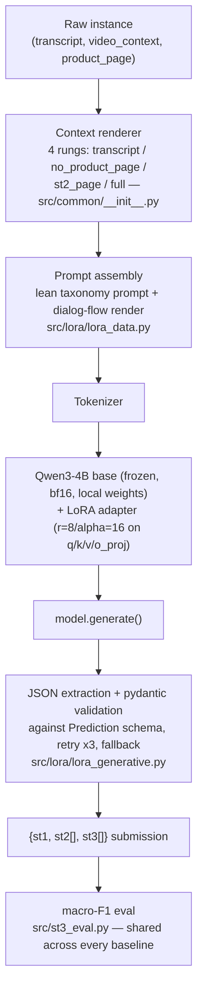
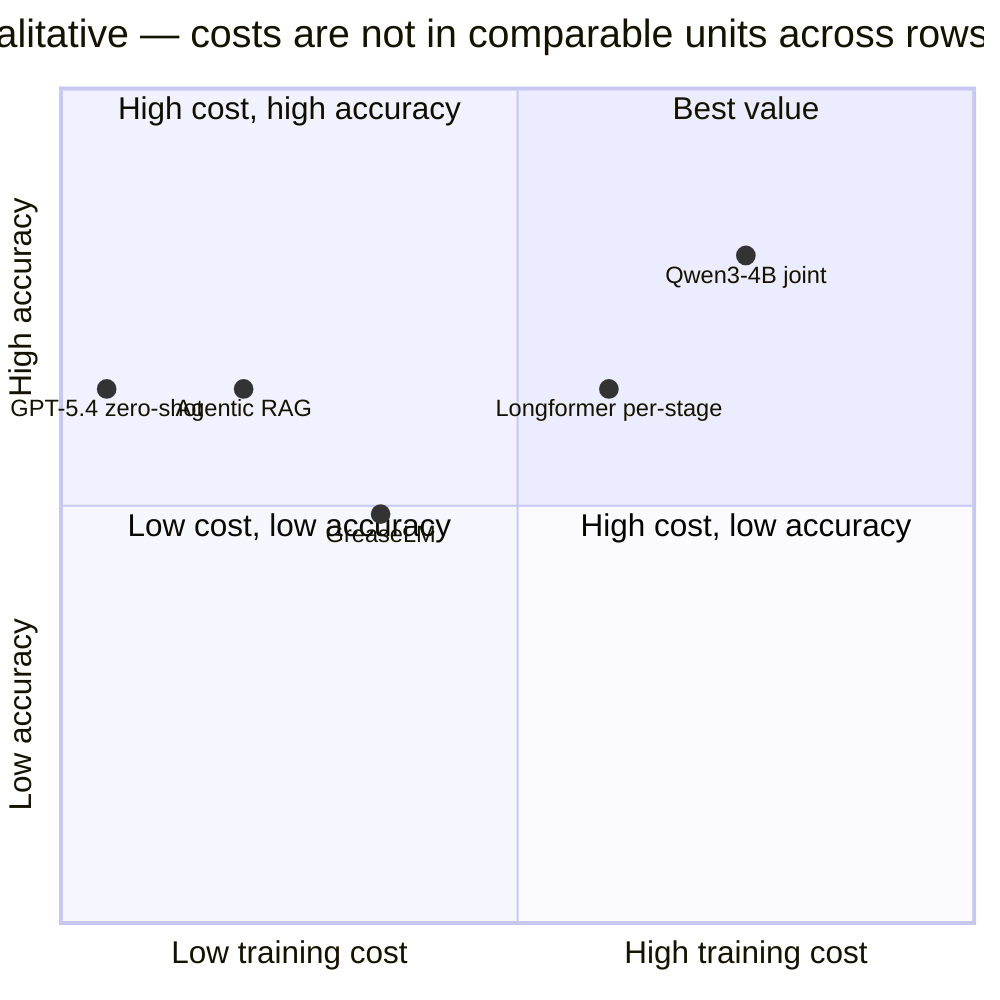

# System Design Report: Qwen3-4B for ChildSafeAds

*ChildSafeAds@EMNLP shared task — qualitative system design report, per the task's Evaluation
section ("a concise document recording your design decisions and the trade-offs you weighed").*

## Summary

Our best-performing system is a **single Qwen3-4B model, LoRA fine-tuned to jointly generate all
three subtask labels (ST1 commercial type, ST2 product category, ST3 compliance-risk flags) as one
structured JSON completion per instance.** It beats every other approach we tried this sprint,
including five separately-trained per-stage Longformer classifiers, a zero-shot GPT-5.4 baseline,
an agentic-RAG pipeline, and a GreaseLM knowledge-graph baseline:

| | dev mean_macro_f1 | test mean_macro_f1 |
|---|---|---|
| **Qwen3-4B joint (this report)** | **0.706** | **0.746** |
| Best per-stage Longformer classifiers (3 separate adapters) | — | st1=0.629 / st2=0.808 / st3=0.486 |

Source: `slurm_logs/8-17-runs/results_summary.md`,
`slurm_logs/8-17-runs/slurm_lora_train_generative_20260817_210119.log`. This checkpoint has since
been used to generate our actual shared-task test submission (§5.3) — the numbers above remain the
best *scored* result we have, since the real test set ships without gold labels. The rest of this report
explains why this design was chosen, what it costs, where it's weak, and what the comparison
against every other approach we tried actually shows.

## 1. Task

Three subtasks, scored by macro-F1, averaged into `mean_macro_f1`:

- **ST1** — single-label commercial type (`physical_goods`, `digital_content_or_services`,
  `physical_services`, `none`, `other`).
- **ST2** — multi-label product category (12 labels, e.g. `apps`, `gambling`, `gambling_adjacent`).
- **ST3** — multi-label compliance-risk flags (8 Tier-1 scored labels, e.g.
  `undisclosed_advertising`, `misleading_claim`, `direct_exhortation`, `hfss_food_marketing`),
  also scored at the family level: `disclosure`, `content`, `product`, `housekeeping`.

Source: `public_data_dev/labels_taxonomy.md`.

## 2. Approach: why a single generative model, why Qwen3-4B

**Design choice — one joint generative model vs. one classifier per subtask.** A generative
LoRA model can produce `{st1, st2[], st3[]}` from a single forward pass through one adapter, in
contrast to training and deploying a separate classifier per subtask (our own parallel Longformer
track needed 3 adapters for full coverage, run in up to 5 configurations each). This is both a
modeling and an operational choice — see §5 for the direct cost comparison.

**System architecture** (the actual pipeline, traced end-to-end from `src/lora/`):



**Model selection.** We didn't start at Qwen3-4B. Two informative negative results shaped the
choice:

- `microsoft/Phi-4-mini-instruct`: the pipeline worked end-to-end (tokenizes, trains, parses valid
  JSON), but at a 100-example/1-epoch mini-baseline scale the model collapsed to a single constant
  output for every input (`mean_macro_f1=0.000`) — too little training for a novel structured-JSON
  task on this base model.
- `principled-intelligence/gemma-4-E2B-it-text-only`: promising at the same 100-example scale
  (dev=0.562, a real discriminating signal), but collapsed to near-total generation failure at full
  scale (dev≈0.004–0.007) — the model emitted only `<eos>` for every input. Loss looked healthy
  (0.55→0.10), so this reads as training instability at Qwen's tuned LR (2e-4) over far more steps
  than the mini-baseline ever saw, not a data or labeling bug.

Source: `runs/lora-qwen/results.csv`, commit `dd7f95e` rows. We scaled from Qwen3-0.6B (cheap
iteration, where the LoRA config and loss-weighting recipe were developed) up to Qwen3-4B once that
recipe had stabilized.

**Invocation.** Local HF weights only (`local_files_only=True`, no runtime download), bf16 full
precision. QLoRA (`--load-in-4bit`) exists as an opt-in code path but was never used in practice —
`bitsandbytes` isn't even in `requirements.txt`. Source: `src/lora/lora_model.py`,
`requirements.txt`.

## 3. Data and context-level design

Four nested context "rungs" are available across the whole project (`src/common/__init__.py`,
`CONTEXT_CHOICES`): `transcript` → `no_product_page` (+ video title/description/
official_disclosure) → `st2_page` (+ product page filtered to category vocabulary) → `full`
(+ entire product page). Token-budget coverage across all 2,857 train+dev instances:

| Cap (tokens) | Instance coverage |
|---|---|
| 512 | 2.5% |
| 1024 | 32.3% |
| 2048 | 79.0% |
| 4096 | 99.51% |
| 8192 | 99.965% |

Source: `HANDOFF.md` context-window sizing note.

**Per-label context sensitivity is uneven** — a finding we didn't fully act on. A rung-scoped
heuristic analysis (`st3_findings.md`) found that only `misleading_claim` clearly benefits from
paying for the full product-page rung (F1 0.451→0.632 transcript vs. full); four of the other six
labels tested actively do *worse* with more context as precision collapses faster than recall
improves. Our standing joint recipe nonetheless uses `--context full` uniformly for every label —
a genuine inefficiency we flag in §6.

**Prompt format.** The standing recipe uses `--lean-prompt` (the compact taxonomy prompt,
1,698 characters) plus the rendered dialog-flow graph (5,685 characters,
`emnllp-dialog-flow-dialog-flow.json`), rather than the full zero-shot `SYSTEM_PROMPT` used by the
GPT baseline (~3,533 tokens). Source: run log
`slurm_logs/8-17-runs/slurm_lora_train_generative_20260817_210119.log`
("system prompt: lean (1698 chars) + dialog flow ... 5685 chars").

## 4. Training design and engineering

**Standing recipe** (the 20-epoch "long runners" run that produced our headline result):

```
--model Qwen/Qwen3-4B --context full --lean-prompt --df-path emnllp-dialog-flow-dialog-flow.json
--epochs 20 --batch-size 1 --grad-accum-steps 4 --lr 2e-4 --warmup-ratio 0.06
--lora-r 8 --lora-alpha 16 --lora-dropout 0.1 --target-modules q_proj,k_proj,v_proj,o_proj
--pos-weight --test-holdout 500 --eval-batch-size 16
```

Class imbalance is handled via `--pos-weight` (per-label inverse-frequency loss weighting on
completion tokens; e.g. `hfss_food_marketing`/`insufficient_context` were weighted 50×). A
follow-up sweep of 6 configurations (finer eval cadence, `--oversample-rare-st3`, larger effective
batch, lower LR + more dropout, `--st3-loss-weight`, and combinations) was written
(`slurm_dispatch_qwen_generative.sh`) but **has not yet been launched** — no output directories or
logs exist for it as of this report. We report this as a concrete next step rather than fabricate
results for it.

**Evaluation methodology.** Every run holds out a *fresh, randomly re-split* 500-instance
`test_holdout` from `train.jsonl` (disjoint from the fixed 504-instance `dev.jsonl`), rather than
tuning against a single static dev set — a deliberate anti-overfitting design. This surfaced a real
finding worth reporting honestly: identical-recipe runs on different random splits show
mean_macro_f1 swings of roughly 0.07–0.22, so any single run's score should be read as one noisy
sample, not a precise point estimate (`runs/lora-qwen/results.csv`, e.g. rows for commit `1294f42`
exp5 vs. baseline).

**Engineering fixes that made Qwen3-4B feasible on a single A10G (23GB):**
- Gradient checkpointing enabled specifically for Qwen's large vocabulary head (commit `5b5c71c`).
- Model weights streamed straight to the target device instead of staged in CPU RAM first
  (commit `dd7f95e`).
- The training model is explicitly freed (`del model; torch.cuda.empty_cache()`) before a second
  model instance is loaded for the test-holdout pass — this was silently fine at 0.6B scale but a
  genuine OOM at 4B scale until fixed (commit `b6ec7b4`).

**Actual training cost, measured** (not estimated): the 20-epoch run took **3h46m34s** wall-clock
total on a single A10G — training stabilized at **~10–11 minutes/epoch** after the first epoch
(13m05s, includes setup), plus a ~2m46s dev-generation pass and a ~3m06s test-holdout pass at the
end. Source: timestamps in
`slurm_logs/8-17-runs/slurm_lora_train_generative_20260817_210119.log`.

## 5. Results

### Headline comparison

Only approaches that report a full 3-subtask `mean_macro_f1` are directly comparable to Qwen3-4B's
headline number:

| Approach | Best score | Eval set | Source |
|---|---|---|---|
| Majority baseline | 0.093 mean | dev, full 504 | `starting_kit/baseline_majority.py` |
| **Qwen3-4B joint (this system)** | **0.706 dev / 0.746 test** | dev 504 / test_holdout 500 | `slurm_logs/8-17-runs/results_summary.md` |
| GPT-5.4 zero-shot | 0.641 mean | dev 504 (never run on test) | `runs/run_20260801_205209_full_gpt-5.4.log` |
| Agentic RAG (GPT-5.4) | 0.637 mean | dev 504 (never run on test) | `runs/run_20260802_004514_agentic_rag_full_gpt-5.4.log` |
| `last_layer` (frozen-encoder) | 0.618 mean | dev only, no test score logged | `runs/run_20260808_202345_last_layer_train_...log` |
| GreaseLM (combined KG) | 0.489 mean | dev, **300-instance subsample** — not apples-to-apples | `runs/run_20260809_202020_greaselm_train_combined.log` |

Qwen3-4B's joint adapter also beats the best per-stage Longformer classifiers on **all three**
subtasks individually, despite those being 3–5 separately trained models each targeting one
subtask:

| Stage | Best Longformer classifier (test) | Qwen3-4B joint (test) |
|---|---|---|
| ST1 | 0.629 | **0.790** |
| ST2 | 0.808 | **0.842** |
| ST3 | 0.486 | **0.605** |

A separate st3-only sub-table (classical ML track — decision tree/forest grid, per-label ensemble,
MLP-from-scratch, commit `e12963d`, all logged in `runs/baseline_decision_tree/results.csv`) tops
out at test_st3_macro_f1=0.525 (forest grid winner) — below Qwen3-4B's 0.605, and not a 3-subtask
mean so not directly comparable either way. A disclosure-span tagger
(`src/disclosure_tagger_train.py`) reports token-span F1 (0.256 dev), not macro-F1, and its
end-to-end pipeline (`src/disclosure_pipeline.py`) was never run to completion — an unfinished
exploratory direction, not a scored result.

### Known failure mode

`hfss_food_marketing` sits at F1=0.000 on our best checkpoint despite a 50× loss weight
(per-label breakdown, same run log, epoch 20). It was non-zero at epoch 10 (F1=0.143) and
regressed to 0 by epoch 20 — training past the point where train loss reaches ~0 actively erased
this rare label rather than leaving it flat. `st3_findings.md`'s manual review of this label found
the same brand running near-identical templated ad copy across ~10 videos with only 1 flagged,
and flagged instances explicitly saying "sugar-free" — evidence the achievable ceiling here may be
capped by label-noise, not purely a modeling gap.

### 5.3 Shared-task test submission

On 2026-08-18 we generated our actual competition submission by running the standing best
checkpoint (`/scratch/kwang103/8-17-new-lora_qwen3-4B/best/`, the same adapter behind the headline
numbers above) over the real, official `public_data_test/test.jsonl` (503 instances — distinct
from the internal rotating `test_holdout` used throughout this report for model selection).
Source: `slurm_logs/8-17-runs/slurm_lora_predict_generative_20260818_111234.log`; output at
`slurm_logs/8-17-runs/submission-8-18-new-lora_qwen3-4B.jsonl`, copied to the canonical
`submission_lora_generative.jsonl`. The official test split ships without gold labels, so **no
macro-F1 is computable for this submission** — it is not a new best score, only a new artifact. As
a sanity check, the predicted ST3 label distribution (`misleading_claim` 278, `no_flag` 119,
`inadequate_disclosure` 117, `undisclosed_advertising` 96, `direct_exhortation` 48,
`age_restricted_or_prohibited_product` 8, `hfss_food_marketing` 3, `insufficient_context` 1) tracks
the same rank ordering seen in the training-set label frequencies (§1, `st3_findings.md`) and in
every dev/test_holdout run in this report, including `hfss_food_marketing`/`insufficient_context`
staying near-absent — consistent with, not contradicting, the known rare-label weakness in §5.2.

## 6. Trade-off analysis

**Approach-level: cost vs. accuracy vs. generalization.** This table operationalizes the
"cost and generalisability" question directly rather than leaving it as prose. Dev/test agreement
is only meaningful where both were actually measured — GPT/RAG/GreaseLM were never scored against
a held-out test split, so their generalization is *unmeasured*, not necessarily worse.

| Approach | Train cost | Models needed for full coverage | Inference | Accuracy | Dev/test agreement |
|---|---|---|---|---|---|
| Qwen3-4B joint | 3h46m, 1 GPU, one run | 1 | Local, `model.generate()` per instance | 0.706 dev / 0.746 test | Measured — test > dev, no overfitting flag |
| Longformer per-stage | ~15–20 min/epoch × 5-config sweeps × 3 stages | 3–5 | Local, classifier head (fast) | st1=0.629/st2=0.808/st3=0.486 test | Measured per stage |
| GPT-5.4 zero-shot | None (no training) | 1 prompt | Per-instance API call, cost scales with volume | 0.641 dev | Unmeasured (never run on test) |
| Agentic RAG | None (no training) | 1 pipeline + retrieval index | API + retrieval per instance, slower | 0.637 dev | Unmeasured |
| GreaseLM | KG construction + training | 1 model, but needs a KG-build pipeline | Local, graph-dependent | 0.489 dev (300-ex subsample) | Unmeasured, and not on the full dataset |



**Context-level cost vs. accuracy.** Cross-referencing the token-coverage table (§3) against
`st3_findings.md`'s per-label rung analysis shows most of the ST3 taxonomy doesn't need the
expensive `full` rung:

| Rung | Relative token cost | ST3 labels that need it | ST3 labels hurt/flat with it |
|---|---|---|---|
| transcript | Cheapest | `direct_exhortation`, `age_restricted_or_prohibited_product`, `hfss_food_marketing` (best rung for each) | — |
| no_product_page | + description/disclosure metadata | `undisclosed_advertising`, `insufficient_context`, `inadequate_disclosure`, `no_flag` | `direct_exhortation` (flat), `age_restricted...` (precision collapses) |
| full | Most expensive | `misleading_claim` only | `direct_exhortation`, `age_restricted...`, `hfss_food_marketing` all regress |

Our standing joint recipe pays the `full` rung's token cost for every instance regardless of which
label is being predicted — a real, reportable inefficiency: 7 of 8 ST3 labels don't benefit from
(and several are actively hurt by) the context level we uniformly use.

**Operational simplicity.** One deployable LoRA adapter, one inference pipeline, versus
maintaining 3–5 separate classifier checkpoints (Longformer track) or a live external API
dependency (GPT/RAG track) for a system meant to run continuously over a monitoring stream.

## 7. Limitations and honest gaps

- **Rare ST3 labels remain hard.** `insufficient_context`, `hfss_food_marketing`, and
  `age_restricted_or_prohibited_product` (15–75 train examples each) are resistant to loss
  reweighting; `hfss_food_marketing` specifically may face a genuine label-noise ceiling (§5).
- **No legal-provisions retrieval in this path.** The lean prompt used by Qwen3-4B explicitly
  treats legal instruments and `legal_provisions.json` grounding as "fixed attributes of a flag"
  the model is not asked to predict (`src/common/labels_taxonomy_sft.md`) — richer legal context
  was never fed into this model's input, by design, not by omission. This is exactly the "did
  richer legal context help" question the task asks about, and for this system the honest answer
  is: untried.
- **Tier 2 (destination-transaction) flags not pursued.** Scope boundary, not a failure — Tier 2
  is explicitly an opt-in bonus track requiring off-platform data collection.
- **The follow-up hyperparameter sweep is unrun** (§4) — six configurations targeting the
  `hfss_food_marketing` collapse and general ST3 weakness are written and ready but not yet
  executed as of this report.
- **Single-run noise floor.** Given the ~0.07–0.22 mean_macro_f1 swing observed between
  identical-recipe runs on different splits (§4), our headline 0.706/0.746 should be read as one
  favorable-but-plausible sample, not a precise estimate, until replicated.

## 8. Appendix

**Environment** (`requirements.txt`): `torch==2.13.0`, `transformers==5.14.1`, `peft==0.20.0`,
`accelerate==1.14.0`. No `vllm`, `unsloth`, or `bitsandbytes` — inference is plain
`transformers.generate()`.

**Reproducing the headline run:**
```
python src/lora/lora_train_generative.py public_data_dev/train.jsonl public_data_dev/dev.jsonl \
  --model Qwen/Qwen3-4B --context full --lean-prompt \
  --df-path emnllp-dialog-flow-dialog-flow.json \
  --epochs 20 --batch-size 1 --grad-accum-steps 4 --eval-every 10 \
  --lora-r 8 --lora-alpha 16 --target-modules q_proj,k_proj,v_proj,o_proj \
  --pos-weight --test-holdout 500 --eval-batch-size 16
```

**Raw data for verification:** `runs/lora-qwen/results.csv` (Qwen ablation history),
`runs/results_st1_classifiers.csv` (Longformer/RoBERTa/legal-bert st1 track),
`runs/baseline_decision_tree/results.csv` (classical ML st3 baselines),
`slurm_logs/8-17-runs/results_summary.md` (headline cross-model comparison),
`st3_findings.md` (per-label context-rung analysis).
